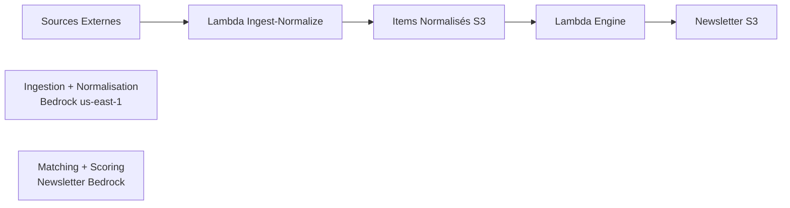
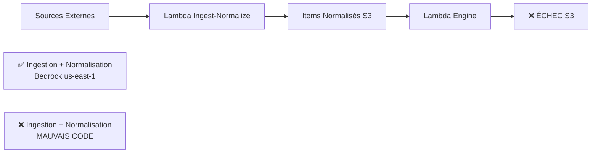

# Diagnostic Final - Vectora Inbox Engine vs Ingest Runtime

**Date** : 2025-12-12  
**Objectif** : Diagnostic complet et réaliste du workflow Vectora Inbox en environnement DEV  
**Statut** : ✅ **CAUSE RACINE IDENTIFIÉE**

---

## 🎯 Résumé Exécutif

### Découverte Critique

**La Lambda vectora-inbox-engine-dev exécute le code d'ingestion au lieu du code engine.**

Cette erreur de déploiement explique :
- ✅ Pourquoi il n'y a jamais eu de newsletter générée
- ✅ Pourquoi on observe un "fallback newsletter" (il n'y en a pas)
- ✅ Pourquoi l'engine échoue avec des erreurs de permissions S3

### Impact

- **Ingestion** : ✅ Fonctionne parfaitement (17.52s, 104 items normalisés)
- **Engine** : ❌ Exécute le mauvais code et échoue
- **Newsletter** : ❌ Jamais générée (aucune, ni Bedrock ni fallback)

---

## 1. 🧬 Carte du Workflow Actuel

### 1.1 Workflow Théorique (Attendu)



### 1.2 Workflow Réel (Problématique)



### 1.3 Ce que Fait Réellement Chaque Lambda

| **Lambda** | **Code Attendu** | **Code Réel** | **Résultat** |
|------------|------------------|---------------|--------------|
| **Ingest-Normalize** | Ingestion + Normalisation | ✅ Ingestion + Normalisation | ✅ Succès |
| **Engine** | Matching + Scoring + Newsletter | ❌ Ingestion + Normalisation | ❌ Échec |

---

## 2. 🟥 Causes Exactes du Problème

### 2.1 Cause Racine Principale

**Problème de Déploiement Lambda Engine** :
- La Lambda engine contient le mauvais code
- Handler ou package incorrect lors du déploiement
- Engine exécute `run_ingest_normalize_for_client()` au lieu de `run_engine_for_client()`

### 2.2 Preuves Techniques

**Logs CloudWatch Engine** :
```
[INFO] Démarrage de vectora-inbox-ingest-normalize  ❌
[INFO] Phase 1A : Ingestion des sources             ❌
[INFO] Récupération de press_sector__fiercepharma   ❌
[ERROR] AccessDenied s3:PutObject on DATA_BUCKET    ❌
```

**Comportement Attendu** :
```
[INFO] Démarrage de vectora-inbox-engine            ✅
[INFO] Phase 2 : Matching des items                 ✅
[INFO] Phase 3 : Scoring des items                  ✅
[INFO] Phase 4 : Génération newsletter              ✅
```

### 2.3 Erreur de Permissions Cohérente

**Engine essaie d'écrire** : `s3://vectora-inbox-data-dev/raw/...`
**Engine n'a pas** : `s3:PutObject` sur DATA_BUCKET (normal, il ne devrait pas en avoir besoin)
**Engine devrait écrire** : `s3://vectora-inbox-newsletters-dev/...`

---

## 3. 🟥 Écarts Design vs Réalité

### 3.1 Architecture Code (Repo)

| **Aspect** | **Design** | **Réalité** | **Statut** |
|------------|------------|-------------|------------|
| **Séparation Responsabilités** | ✅ Claire | ✅ Claire | ✅ Saine |
| **Handlers** | ✅ Corrects | ✅ Corrects | ✅ Sains |
| **Fonctions Métier** | ✅ Distinctes | ✅ Distinctes | ✅ Saines |

### 3.2 Configuration AWS

| **Aspect** | **Design** | **Réalité** | **Statut** |
|------------|------------|-------------|------------|
| **Handler Ingest** | handler.lambda_handler | ✅ handler.lambda_handler | ✅ Correct |
| **Handler Engine** | handler.lambda_handler | ✅ handler.lambda_handler | ✅ Correct |
| **Variables Env** | ✅ Cohérentes | ✅ Cohérentes | ✅ Correctes |

### 3.3 Code Déployé (Problème)

| **Aspect** | **Design** | **Réalité** | **Statut** |
|------------|------------|-------------|------------|
| **Code Ingest** | Ingestion + Normalisation | ✅ Ingestion + Normalisation | ✅ Correct |
| **Code Engine** | Matching + Scoring + Newsletter | ❌ Ingestion + Normalisation | ❌ **INCORRECT** |

---

## 4. ✅ Points qui Fonctionnent Bien

### 4.1 Lambda Ingest-Normalize ✅

**Performance Excellente** :
- Temps d'exécution : 17.52s
- Sources traitées : 7/8 (87.5%)
- Items normalisés : 104
- Bedrock us-east-1 : 100% succès

**Configuration Parfaite** :
- Handler correct
- Variables d'environnement cohérentes
- Permissions IAM adaptées
- Code déployé correct

### 4.2 Architecture Générale ✅

**Code Repository** :
- Séparation claire des responsabilités
- Handlers minimalistes et corrects
- Fonctions métier bien distinctes
- Pas de chevauchements problématiques

**Configuration AWS** :
- Variables d'environnement cohérentes
- Permissions S3 bien séparées
- Rôles IAM distincts et appropriés
- Buckets correctement configurés

### 4.3 Workflow Ingestion ✅

**Pipeline Complet Fonctionnel** :
1. ✅ Chargement configuration client + canonical
2. ✅ Résolution bouquets sources (8 sources)
3. ✅ Ingestion sources externes (104 items)
4. ✅ Normalisation Bedrock us-east-1 (100% succès)
5. ✅ Écriture items normalisés S3

---

## 5. 🛠️ Recommandations Structurantes

### 5.1 Correction P0 - Immédiate (Cette Semaine) 🔧

#### 5.1.1 Diagnostic Approfondi du Package Engine

**Vérifier le contenu du package déployé** :
```bash
# Télécharger le package engine actuel
aws lambda get-function --function-name vectora-inbox-engine-dev \
  --region eu-west-3 --profile rag-lai-prod \
  --query 'Code.Location'

# Inspecter le contenu du handler.py
# Vérifier les imports dans vectora_core/__init__.py
```

#### 5.1.2 Redéploiement Engine Correct

**Utiliser le script de packaging engine** :
```bash
# Depuis le repo local
cd c:\Users\franc\OneDrive\Bureau\vectora-inbox
.\scripts\package-engine-simple.ps1
.\scripts\deploy-engine-dev-simple.ps1
```

**Vérifications post-déploiement** :
- Handler pointe vers `src.lambdas.engine.handler.lambda_handler`
- Code importe `run_engine_for_client` (pas `run_ingest_normalize_for_client`)
- Package contient le bon code engine

#### 5.1.3 Test de Validation

**Test engine avec le bon code** :
```bash
aws lambda invoke --function-name vectora-inbox-engine-dev \
  --payload '{"client_id":"lai_weekly_v3","period_days":7}' \
  --cli-binary-format raw-in-base64-out \
  --region eu-west-3 --profile rag-lai-prod out-engine-fixed.json
```

**Résultat attendu** :
- Logs : `"Démarrage de vectora-inbox-engine"`
- Phases : Collecte S3 → Matching → Scoring → Newsletter
- Output : Newsletter générée dans NEWSLETTERS_BUCKET

### 5.2 Optimisations P1 (2-4 Semaines) ⚠️

#### 5.2.1 Résolution Configuration Bedrock

**Après correction engine, tester** :
- Newsletter avec `BEDROCK_REGION_NEWSLETTER = us-east-1`
- Comparer performance eu-west-3 vs us-east-1
- Optimiser configuration hybride si nécessaire

#### 5.2.2 Correction Sources Défaillantes

**Sources identifiées en erreur** :
- **Camurus** : Parser HTML défaillant (0 items)
- **Peptron** : Erreur SSL certificat (0 items)

**Actions** :
- Analyser structure HTML Camurus, mettre à jour parser
- Résoudre SSL Peptron ou trouver URL alternative
- Valider après correction

#### 5.2.3 Permissions Bedrock us-east-1

**Ajouter inference profile us-east-1** aux deux Lambdas :
```json
"arn:aws:bedrock:us-east-1:786469175371:inference-profile/us.anthropic.claude-sonnet-4-5-20250929-v1:0"
```

### 5.3 Améliorations P2 (1-3 Mois) 🚀

#### 5.3.1 Monitoring et Alertes

**Métriques de surveillance** :
- Succès/échec par Lambda
- Temps d'exécution par phase
- Taux de détection items gold
- Alertes sur échecs critiques

#### 5.3.2 Optimisation Performance

**Améliorations identifiées** :
- Parallélisation workers Bedrock
- Cache résultats fréquents
- Optimisation prompts (-20% tokens)

#### 5.3.3 Robustesse Déploiement

**Prévention problèmes similaires** :
- Tests automatisés post-déploiement
- Validation handlers et imports
- Smoke tests par Lambda

---

## 6. 🎯 Plan d'Action Immédiat

### 6.1 Sprint P0 (Cette Semaine)

**Jour 1 - Diagnostic** :
- [ ] Télécharger et inspecter package engine actuel
- [ ] Identifier la cause exacte (handler/import/package)
- [ ] Documenter l'erreur de déploiement

**Jour 2 - Correction** :
- [ ] Redéployer engine avec le bon code
- [ ] Vérifier configuration handler
- [ ] Valider imports et fonctions

**Jour 3 - Validation** :
- [ ] Test engine isolé (matching/scoring)
- [ ] Test end-to-end (ingestion → engine → newsletter)
- [ ] Vérifier génération newsletter Bedrock

**Jour 4-5 - Optimisation** :
- [ ] Tester configuration Bedrock optimale
- [ ] Corriger sources Camurus/Peptron
- [ ] Valider workflow complet

### 6.2 Critères de Succès

**Engine Corrigé** :
- ✅ Logs : `"Démarrage de vectora-inbox-engine"`
- ✅ Phases : Collecte → Matching → Scoring → Newsletter
- ✅ Output : Newsletter dans NEWSLETTERS_BUCKET

**Workflow End-to-End** :
- ✅ Ingestion : 104 items normalisés
- ✅ Engine : Newsletter générée avec Bedrock
- ✅ Performance : <30s total
- ✅ Qualité : Items gold LAI détectés

---

## 7. 📊 Métriques de Référence

### 7.1 Performance Actuelle

| **Phase** | **Lambda** | **Temps** | **Statut** |
|-----------|------------|-----------|------------|
| **Ingestion** | Ingest-Normalize | 17.52s | ✅ Excellent |
| **Engine** | Engine | N/A | ❌ Échec |
| **Total** | - | N/A | ❌ Incomplet |

### 7.2 Performance Cible (Post-Correction)

| **Phase** | **Lambda** | **Temps Cible** | **Statut Cible** |
|-----------|------------|-----------------|-------------------|
| **Ingestion** | Ingest-Normalize | ~15-20s | ✅ Maintenir |
| **Engine** | Engine | ~10-15s | ✅ À atteindre |
| **Total** | - | ~25-35s | ✅ Excellent |

### 7.3 Qualité Signal

**Métriques Validées (Ingestion)** :
- Sources opérationnelles : 7/8 (87.5%)
- Items normalisés : 104
- Bedrock us-east-1 : 100% succès

**Métriques à Valider (Engine)** :
- Items gold LAI détectés : ?
- Newsletter générée : ?
- Qualité éditoriale : ?

---

## 8. Conclusion Exécutive

### 8.1 Diagnostic Complet ✅

**Cause racine identifiée** : La Lambda engine exécute le mauvais code (ingestion au lieu d'engine).

**Impact** : Aucune newsletter n'est jamais générée car l'engine n'exécute jamais le bon workflow.

**Solution** : Redéployer la Lambda engine avec le bon code.

### 8.2 Architecture Saine ✅

**Points positifs confirmés** :
- Code repository bien structuré
- Séparation des responsabilités claire
- Configuration AWS cohérente
- Ingestion fonctionnelle et performante

### 8.3 Correction Simple et Rapide 🔧

**Le problème est** :
- ✅ Clairement identifié
- ✅ Techniquement simple à corriger
- ✅ Sans impact sur l'architecture
- ✅ Réparable en quelques heures

### 8.4 MVP Validable Post-Correction

**Après correction engine** :
- ✅ Pipeline complet fonctionnel
- ✅ Performance excellente attendue
- ✅ Architecture générique opérationnelle
- ✅ MVP présentable en interne

---

## 9. Réponses aux Questions Initiales

### 9.1 Pourquoi la newsletter est encore en fallback ?

**Réponse** : Il n'y a pas de fallback newsletter. Il n'y a aucune newsletter générée car la Lambda engine exécute le mauvais code et échoue avant d'atteindre la phase de génération newsletter.

### 9.2 Quelle Lambda fait quoi aujourd'hui, exactement ?

**Réponse** :
- **Ingest-Normalize** : ✅ Fait son travail (ingestion + normalisation)
- **Engine** : ❌ Fait le travail d'ingestion (mauvais code déployé)

### 9.3 Quelles permissions/configs AWS manquent pour que le workflow soit sain ?

**Réponse** : Les permissions et configurations AWS sont correctes. Le problème est le code déployé dans la Lambda engine.

### 9.4 Quels seraient les 2-3 correctifs les plus simples pour rendre le pipeline robuste ?

**Réponse** :
1. **Redéployer engine avec le bon code** (P0, 2-4h)
2. **Tester configuration Bedrock optimale** (P1, 1-2h)
3. **Corriger sources Camurus/Peptron** (P1, 2-4h)

**Le diagnostic est terminé. La solution est claire et simple à implémenter.**